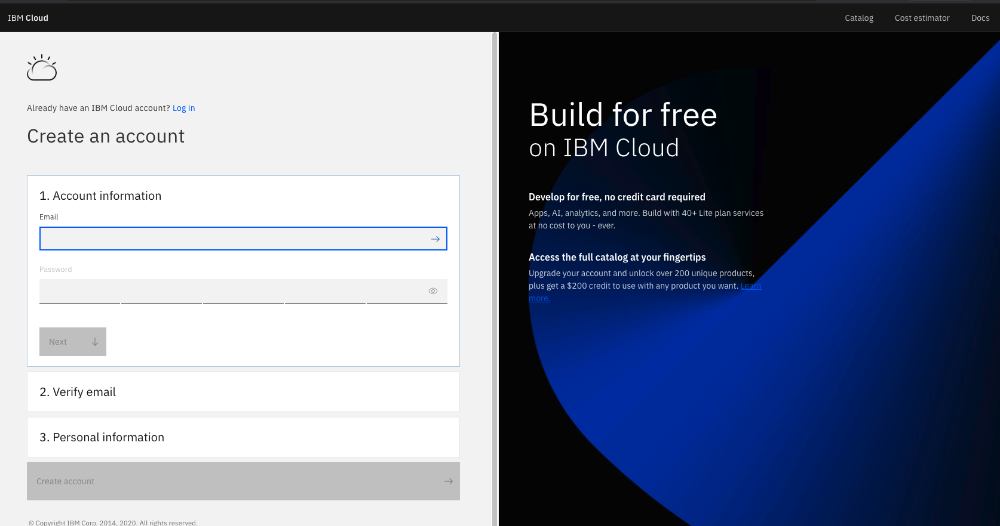
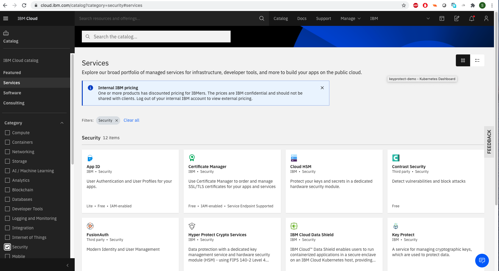
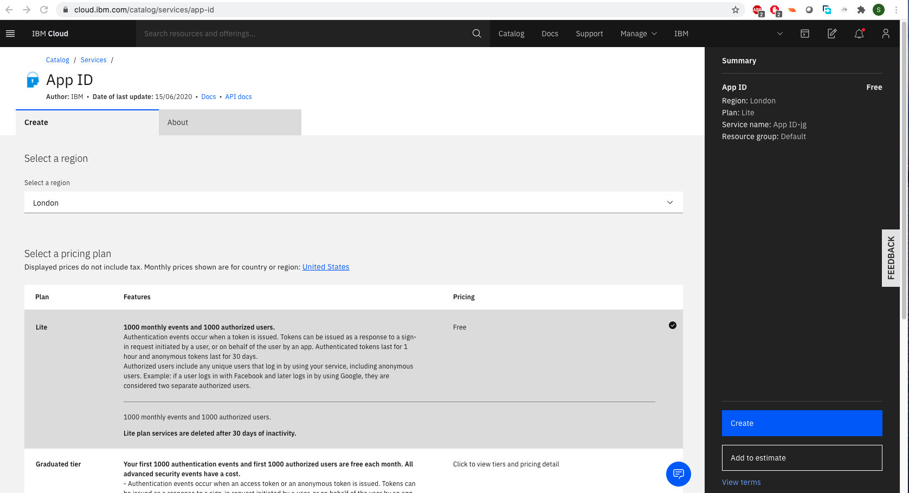
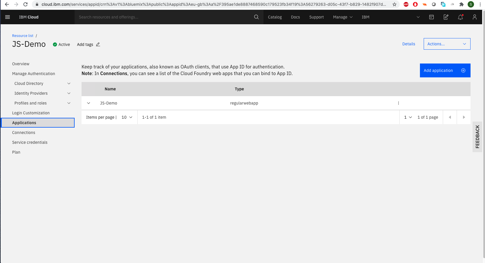
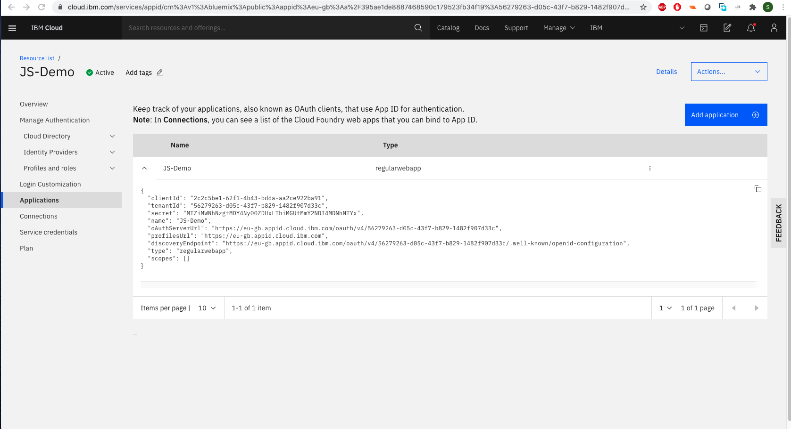
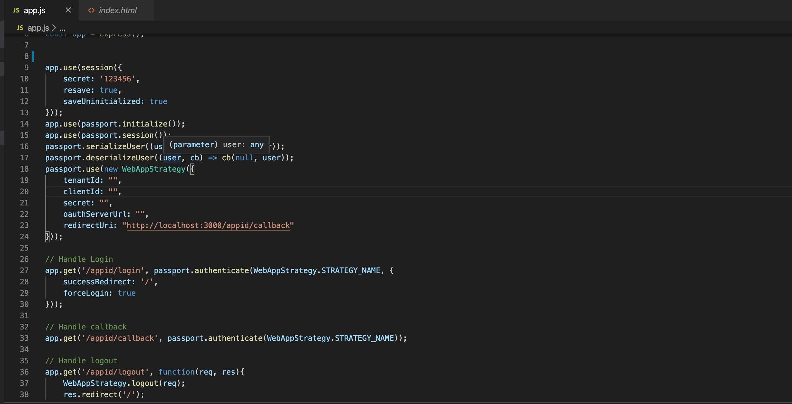
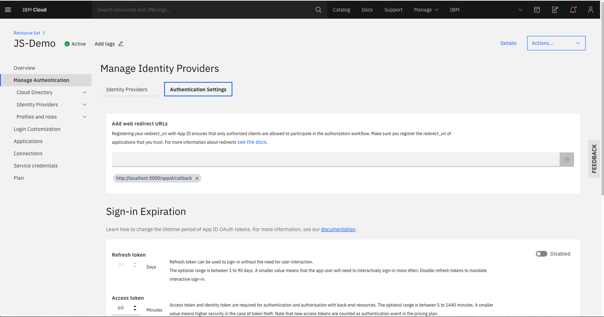

# Authenticate your Web Application running on any Cloud with IBM APP-ID

Authenticate your Application using IBM APP-ID

## Follow below steps:

### Step 1 : Sign-up for IBM Cloud Platform

IBM Cloud Signup-link: [https://cloud.ibm.com](https://cloud.ibm.com)

### Step 2 : Create App-ID service for your Application

From the the IBM Cloud catalog > “Security ” category, select the App ID service. 

### Step 3 : Let's setup your APP-ID service 

1. Click Add Application .
2. Enter your Application Name.
3. Set your type as 'Regular Web Application".
4. Once everything is done click "Save".

### Step 4 : Get your App-ID Credentials

Click "Application" and a new tab will open then you can see your App-ID credentials.

### Step 5 : Enter Credentials in your Web Application JS file

1. Open your terminal and change your directory by using the `cd downloads` command. (Or any other directory in which you want to clone the project.)
2. Run the command: `git clone https://github.com/Saaad-tariq/IBM-APPID.git`.
3. Open the project in Visual Studio.

Enter the credentials in app.js

### Step 6 : Add the web redirect URL in APP ID

When you are on the App ID service dashboard, go to Manage Authentication > Manage Identity Providers.

Add http://localhost:3000/appid/callback as your web redirect URL.

After App ID finishes the OAuth2 process, it redirects to the provided URL.

### Step 7 : Run the application

1. Build and run your application using the following commands
   `npm install` &
  `node app.js`
  
2. After the application is running, open a browser, and go to `http://localhost:3000` It will take you to a login screen.

3. Click the “Login” link, which will take you to the App ID screen.

4. Select the login option on the App ID page, which takes you to the identity provider login page.

5. After successfully signing in, you will be redirected back to the sample app we created with the user information.

